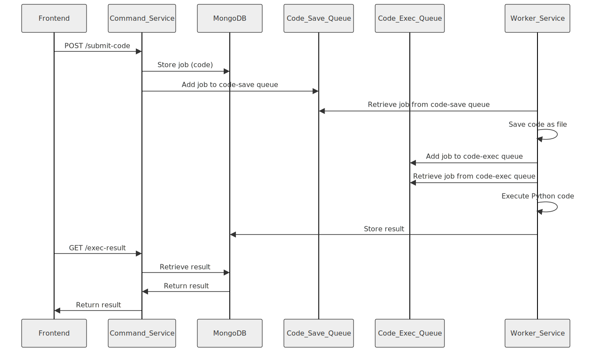

> Currently supported only Python code
> TODO: other codes execution

### NodeJS Service That Executes Python Code

#### Overview
The system allows frontend clients to submit Python code for execution on the server-side. It consists of two microservices: the Command Service and the Worker Service. The Command Service handles code submission and job management, while the Worker Service executes the submitted code asynchronously.

#### Components

1. **Command Service**
   - Responsible for receiving code submissions from the frontend and managing job execution.
   - Stores submitted Python code and job metadata in MongoDB.
   - Enqueues job IDs into the `code-save` queue (Redis) for asynchronous processing by the Worker Service.
   - Provides RESTful APIs for code submission and result retrieval.

2. **Worker Service**
   - Listens to the `code-save` queue for new job IDs.
   - Saves Python code as a file and enqueues the job ID into the `code-exec` queue.
   - Listens to the `code-exec` queue for job execution.
   - Executes the Python code, captures output/errors, and stores the results in MongoDB.
   - Continuously processes incoming jobs from both queues.

3. **Databases**
   - **MongoDB**: Stores job metadata (job ID, status, etc.) and execution results (output, errors, etc.).

4. **Queues**
   - **Redis**: Manages the `code-save` and `code-exec` queues for asynchronous job processing.

#### Workflow

1. **Code Submission Workflow**
   - Frontend submits Python code to `/submit-code` endpoint of Command Service.
   - Command Service stores the code in MongoDB, generates a job ID, and enqueues the job ID in the `code-save` queue.
   - Returns the job ID to the frontend.

2. **Execution Result Retrieval**
   - Frontend polls `/exec-result?jobId={jobId}` endpoint of Command Service to check job status.
   - Command Service retrieves execution results from MongoDB once available.

3. **Worker Service Workflow**
   - **Code Save Workflow**:
     - Worker Service listens to the `code-save` queue for new jobs.
     - Upon receiving a job ID, saves Python code as a file.
     - Enqueues the job ID in the `code-exec` queue.
   - **Code Exec Workflow**:
     - Worker Service listens to the `code-exec` queue for new jobs.
     - Upon receiving a job ID, retrieves the Python code file and executes it.
     - Captures output/errors and stores results in MongoDB.

#### Security Considerations
- **Code Execution Sandbox**: Execute Python code in a secure sandbox (e.g., Docker containers) to prevent malicious activities.
- **Input Validation**: Validate submitted Python code to mitigate injection attacks.
- **Access Controls**: Restrict access to APIs and ensure secure communication (HTTPS).

#### Scalability and Performance
- **Horizontal Scaling**: Both services can be scaled independently to handle increasing code submissions and execution demands.
- **Queue Management**: Efficient queue handling ensures jobs are processed promptly.

#### Technologies Used
- **Node.js (NestJS)**: For building scalable and maintainable backend services.
- **MongoDB**: NoSQL database for storing job metadata and execution results.
- **Redis**: Message queue for managing job queues (`code-save` and `code-exec`).
- **Docker**: Containerization for code execution sandboxing.

#### Conclusion
This architecture ensures efficient and scalable execution of Python code submitted from the frontend, providing reliable and timely results to users.

Feel free to expand or modify this document based on specific requirements and additional details of your implementation.