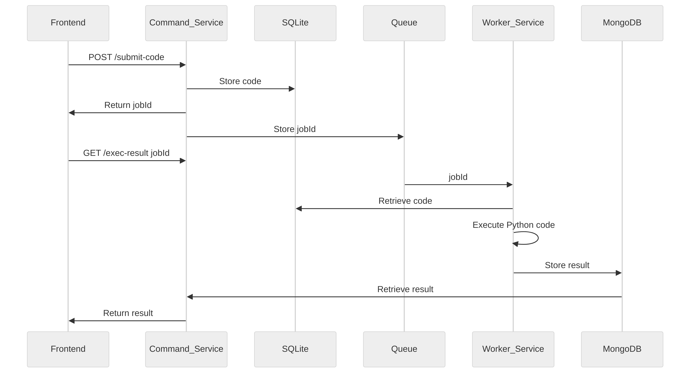

> Currently supported only Python code
> TODO: other codes execution

### System Architecture Design: Python Code Execution Service

#### Overview
The system allows frontend clients to submit Python code for execution on the server-side. It consists of two microservices: the Command Service and the Worker Service. The Command Service handles code submission and job management, while the Worker Service executes the submitted code asynchronously.

#### Components

1. **Command Service**
   - Responsible for receiving code submissions from the frontend and managing job execution.
   - Stores submitted Python code and job metadata in SQLite.
   - Enqueues job IDs into a queue (e.g., RabbitMQ, Redis Queue) for asynchronous processing by the Worker Service.
   - Provides RESTful APIs for code submission and result retrieval.

2. **Worker Service**
   - Listens to the job queue for new job IDs.
   - Retrieves Python code and job details from SQLite based on the received job ID.
   - Executes the Python code in a secure environment (e.g., using Docker for sandboxing).
   - Captures execution output and errors.
   - Stores execution results in MongoDB.
   - Continuously processes incoming jobs from the queue.

3. **Databases**
   - **SQLite**: Stores submitted Python code and job metadata (job ID, status, etc.).
   - **MongoDB**: Stores execution results (output, errors, etc.) associated with each job.

#### Workflow

1. **Code Submission Workflow**
   - Frontend submits Python code to `/submit-code` endpoint of Command Service.
   - Command Service stores the code in SQLite, generates a job ID, and enqueues the job ID.
   - Returns the job ID to the frontend.

2. **Execution Result Retrieval**
   - Frontend polls `/exec-result?jobId={jobId}` endpoint of Command Service to check job status.
   - Command Service retrieves execution results from MongoDB once available.

3. **Worker Service Workflow**
   - Worker Service listens to the job queue for new jobs.
   - Upon receiving a job ID, retrieves Python code and metadata from SQLite.
   - Executes the code, captures output/errors, and stores results in MongoDB.
   - Updates job status in SQLite and dequeues the job ID.

#### Security Considerations
- **Code Execution Sandbox**: Execute Python code in a secure sandbox (e.g., Docker containers) to prevent malicious activities.
- **Input Validation**: Validate submitted Python code to mitigate injection attacks.
- **Access Controls**: Restrict access to APIs and ensure secure communication (HTTPS).

#### Scalability and Performance
- **Horizontal Scaling**: Both services can be scaled independently to handle increasing code submissions and execution demands.
- **Queue Management**: Efficient queue handling ensures jobs are processed promptly.

#### Technologies Used
- **Node.js (NestJS)**: For building scalable and maintainable backend services.
- **SQLite**: Lightweight database for storing job metadata.
- **MongoDB**: NoSQL database for storing execution results.
- **Message Queue**: (e.g., RabbitMQ, Redis Queue) for managing job queues.
- **Docker**: Containerization for code execution sandboxing.

#### Conclusion
This architecture ensures efficient and scalable execution of Python code submitted from the frontend, providing reliable and timely results to users.

Feel free to expand or modify this document based on specific requirements and additional details of your implementation.